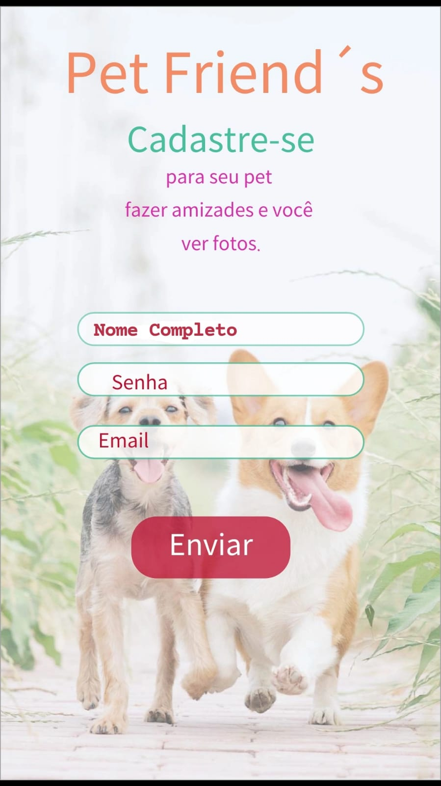
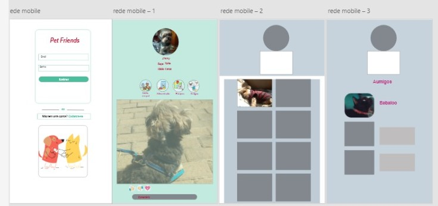

# Criando uma Rede Social

<b> *Acesse a aplicação [Aqui](https://social-network-pet-friends.web.app/) 

## Índice

- [1. Introdução](#1-introdução)
- [2. Resumo do projeto](#2-resumo-do-projeto)
- [3. Pesquisa](#3-Pesquisa)
- [4. Funcionalidades](#4-funcionalidades)
- [5. Protótipos](#5-protótipos)
- [6. Aprendizado](#6-aprendizado)
- [7. Melhorias Futuras] (#7-Melhorias Futuras)

- [. Desenvolvido por](#-desenvolvido-por)

---

## 1. Introdução

O objetivo desse projeto era desenvolver um SPA que permita visualizar, postar dados, e interagir.
A partir de histórias de usuário(a) rede social deve fornecer funcionalidades que estejam de acordo com a necessidade do usuário. O projeto proposto pela Laboratória foi realizado em dupla.

## 2. Resumo do projeto

Obeservamos dois fatores o primeiro é sobre algumas pesquisas informando que os pets durante a pandemia ficaram mais estressados por passarem mais tempo dentro de casa e sem contatos com outros amiguinhos e o outro fator que obsevamos foi dos amantes de pets geralmente ouvem a crítica "-Nossa mas você só posta foto de pets, só fala do seu pet".
Pensando nessses usuários criamos a Pet Friends, uma rede social totalmente voltada aos amantes de pets no geral.

Para o desenvolvimento da rede social fizemos uma pesquisa com usuários na faixa etária entre 18 e 50 anos.

### 3.Pesquisa

### 4.Funcionalidades
Novos usuários podem se cadastrar na rede através do cadastro do próprio site ou pelo login do Google;
Usuários já cadastrados podem acessar a plataforma através de email e senha ou pelo login do Google;
No feed de postagens é possível visualizar todas as postagens, tanto do usuário logado quanto de outros usuários, ordenadas das mais recentes às mais antigas. 
O usuário pode publicar texto, e também podem deletar seus posts após publicado;
Os usuários podem dar like ou desfazê-lo.

### 5. Protótipos

### 6. Aprendizado
Aprendizado:
Manipulação da maior parte do layout da página em Flexbox - CSS
Uso de callbacks, consumo de Promises e uso de ES Modules - JS
Firebase Authentication, Firestore, onSnapshot, onAuthStateChanged e Firebase Hosting - Firebase
Colaboração por Git e GitHub.

Tecnologias Ultilizadas: 

* HTML5 semântico
* Conceitos fundamentais de CSS3
*  Mobile first
* VanillaJS / JavaScript (ES6+)
* Sistema de rotas / (SPA)
 * Notion
 Node.js
 Firebase

### 7. Melhorias Futuras:

* Adicionar Galeria de fotos
* Adicionar imagens na publicação

### .Desenvolvido por:
* [Beatriz Ferraz](https://github.com/bea-ferraz)
* [Thalita Machado](https://github.com/Thalita1044)  
