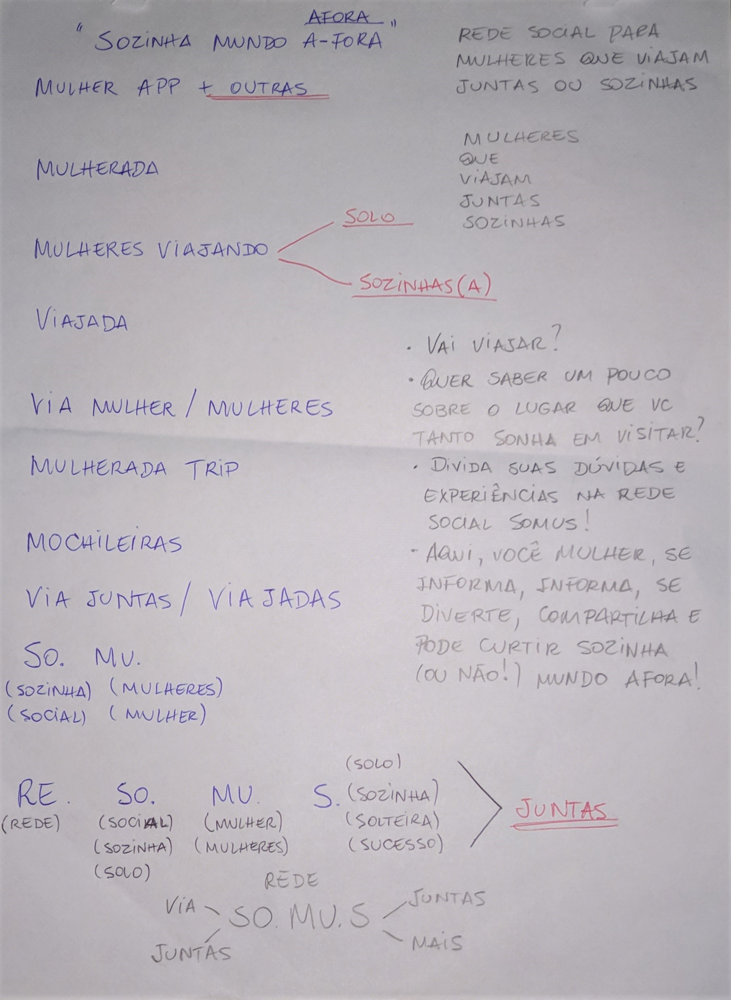
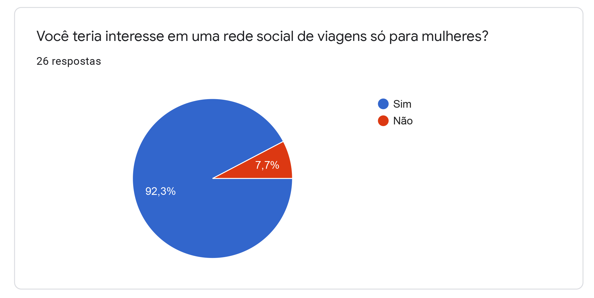
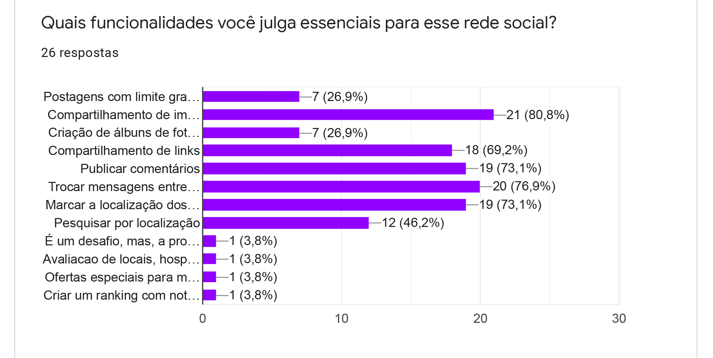
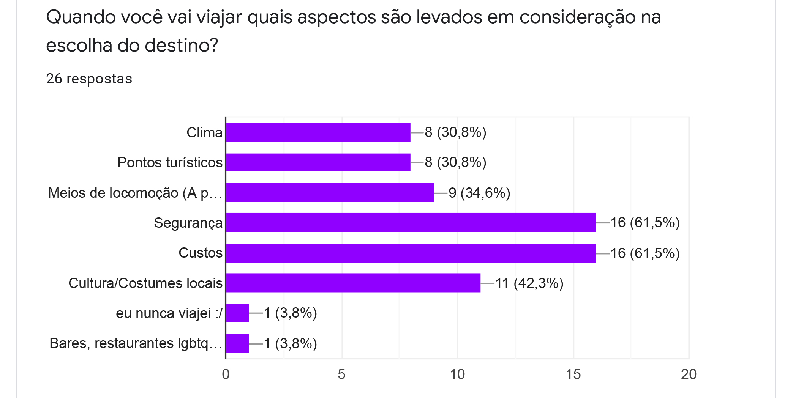
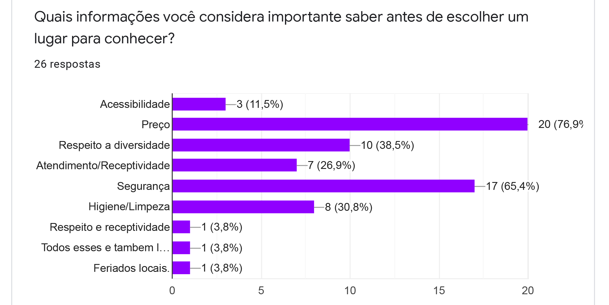
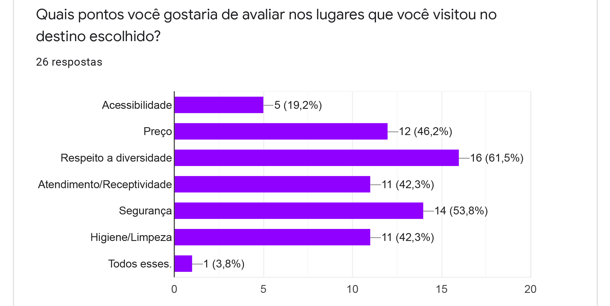
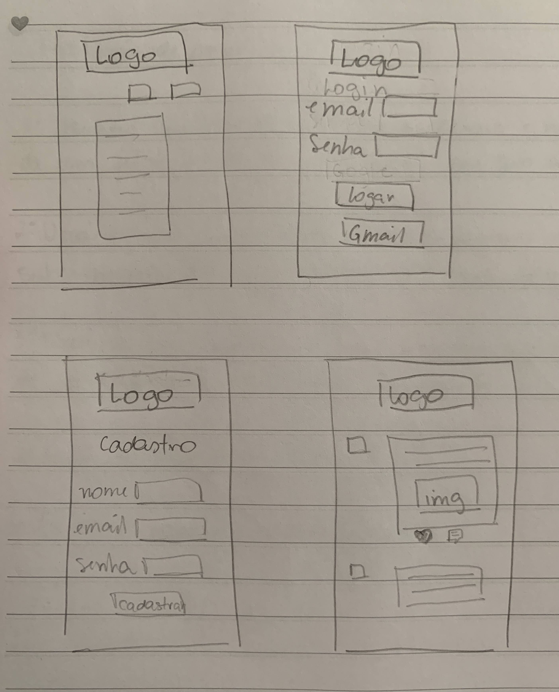

## Índice

- [1. Sobre o projeto](#1-sobre-o-projeto)
- [2. Resumo do projeto](#2-resumo-do-projeto)
- [3. Pesquisa de usuário](#3-pesquisa-de-usuário)
- [4. Histórias de usuário](#4-histórias-de-usuários)
- [5. Protótipo](#5-protótipo)
- [6. Aplicação](#6-aplicação)
- [7. Objetivos de aprendizagem](#7-objetivos-de-aprendiagem)
- [8. Implementações futuras](#8-implementações-futuras)
- [9. Desenvolvedoras](#9-desenvolvedoras)

---

## 1. Sobre o projeto

Viajar é sempre uma experiência incrível e especial para todes. E essa experiência fica melhor ainda quando podemos receber informações detalhadas sobre o lugar que vamos visitar. 

Para nós mulheres essa experiência pode ser bem desafiadora por motivos diversos. Dentre eles estão a falta de segurança, o julgamento social negativo, o machismo e patriarcado enraizado, por exemplo.

Pensando nisso, a Rede Social SO.MU.S. (Rede social para mulheres que viajam, sozinhas ou não) foi criada para que todas possam trocar dicas, dificuldades, dúvidas, experiências e informações diversas sobre suas viagens. Tudo isso dentro de um ambiente seguro e acolhedor para que todas se sintam a vontade para compartilhar suas experiências.

## 2. Resumo do projeto

Fizemos um "brainstorm" e conseguimos levantar algumas ideias para nossa rede social.

Baseando-se nisso, foi realizada uma pesquisa com usuários para que mapeassemos as necessidades que precisariam ser atendidas em nossa aplicação.

## 3. Pesquisa de usuários

## 4. Histórias de usuário :newspaper:

### 4.1 Histórias de usuário 1

"Eu como usuário quero me cadastrar, para ter acesso á rede social"

### 4.2 Histórias de usuário 2

"Eu como usuário quero fazer login na página, para ter acesso às informações "

### 4.3 Histórias de usuário 3

"Eu como usuário quero poder postar relatos das minhas experiências de viagem para que outros usuários leiam."

### 4.4 Histórias de usuário 4

"Eu como usuário quero editar e excluir meus antigos posts."

### 4.5 Histórias de usuário 5

"Eu como usuário quero ler depoimentos de outros usuários em um feed organizado por ordem de data de postagem."

### 4.6 Histórias de usuário 6

"Eu como usuário quero poder curtir e descurtir os posts de outros usuários da rede social."

## 5. Protótipo

## 6. Aplicação :iphone:

### Home

### Cadastro

### Login

### Feed

### Not found

## 7. Objetivos de aprendizagem

O objetivo principal de aprendizagem deste projeto é construir uma [Single-page
Application
(SPA)](https://pt.wikipedia.org/wiki/Aplicativo_de_p%C3%A1gina_%C3%BAnica)
[_responsiva_](../../topics/css/02-responsive) (com mais de uma tela/ página) na
qual seja possível **ler e escrever dados.**

### HTML e CSS

- [x] [HTML
      semântico](https://developer.mozilla.org/pt-BR/docs/Glossario/Semantica)
- [x] [CSS `flexbox`](https://css-tricks.com/snippets/css/a-guide-to-flexbox/)

### DOM e Web APIs

- [x] [Manipulação do
      DOM](https://developer.mozilla.org/pt-BR/docs/DOM/Referencia_do_DOM/Introdu%C3%A7%C3%A3o)
- [x] [History
      API](https://developer.mozilla.org/pt-BR/docs/Web/API/History_API)
- [x]
  [`localStorage`](https://developer.mozilla.org/en-US/docs/Web/API/Window/localStorage)

### Javascript

- [x] [Uso de
      callbacks](https://developer.mozilla.org/pt-BR/docs/Glossario/Callback_function)
- [x] [Consumo de
      Promises](https://scotch.io/tutorials/javascript-promises-for-dummies#toc-consuming-promises)
- [x] Uso de ES modules
      ([`import`](https://developer.mozilla.org/en-US/docs/Web/JavaScript/Reference/Statements/import)
      |
      [`export`](https://developer.mozilla.org/en-US/docs/Web/JavaScript/Reference/Statements/export))

### Firebase

- [x] [Firestore](https://firebase.google.com/docs/firestore)
- [x] [Firebase Auth](https://firebase.google.com/docs/auth/web/start)
- [x] [Firebase security rules](https://firebase.google.com/docs/rules)
- [x] [Uso de
      onSnapshot](https://firebase.google.com/docs/firestore/query-data/listen) |
      [onAuthStateChanged](https://firebase.google.com/docs/auth/web/start#set_an_authentication_state_observer_and_get_user_data)

### Git e Github

- [x] [Colaboração pelo Github](https://docs.github.com/pt/github/setting-up-and-managing-your-github-user-account/managing-access-to-your-personal-repositories/inviting-collaborators-to-a-personal-repository)
- [x] [Organização pelo Github](https://docs.github.com/en/issues/organizing-your-work-with-project-boards/managing-project-boards/about-project-boards)

### Boas práticas de programação

- [x] Modularização
- [x] Nomenclatura / Semântica
- [x] Linting

---
## 8. Implementações Futuras 

- Permitir criação e edição de perfil;
- Permitir postagens com foto e localização;
- Permitir comentários nos posts;

---

## 9. Desenvolvedoras :construction_worker_woman:  

### :woman_artist: Bruna Belo
[GitHub](https://github.com/belobruna) | [LinkedIn](https://www.linkedin.com/in/bruna-belo/)

### :woman_artist: Carla Keyse
[GitHub](https://github.com/carlakeyse) | [LinkedIn](https://www.linkedin.com/in/carlakeyse/)

### :woman_artist: Jéssica Inamassu
[GitHub](https://github.com/jehkaori) | [LinkedIn](https://www.linkedin.com/in/jessica-inamassu/)

---